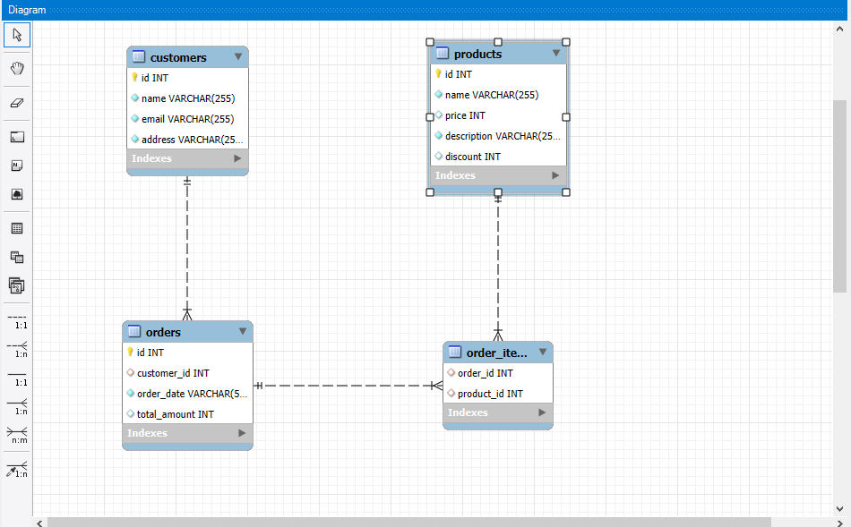

# Task:
Create a database and tables to manage a simple e-commerce system. 
The system should have three tables: customers, orders, and products.

# Requirements:

Create a database named ecommerce.
Create three tables: customers, orders, and products.
Insert some sample data into the tables.

# Final DB Design:

# Steps :

- **1** : Create database
- **2** : Use database
- **3** : Create all three required tables
- **4** : Insert some data into all tables
- **5** : All 10 querires attached in Queries file
- **6** : To add values use SUM() function
- **7** : Create one table name is order_items to normalization order table and product table with id .we can get data through this by using joins.

## Authors

- [@ Vengat p](https://github.com/Vengat-P)
